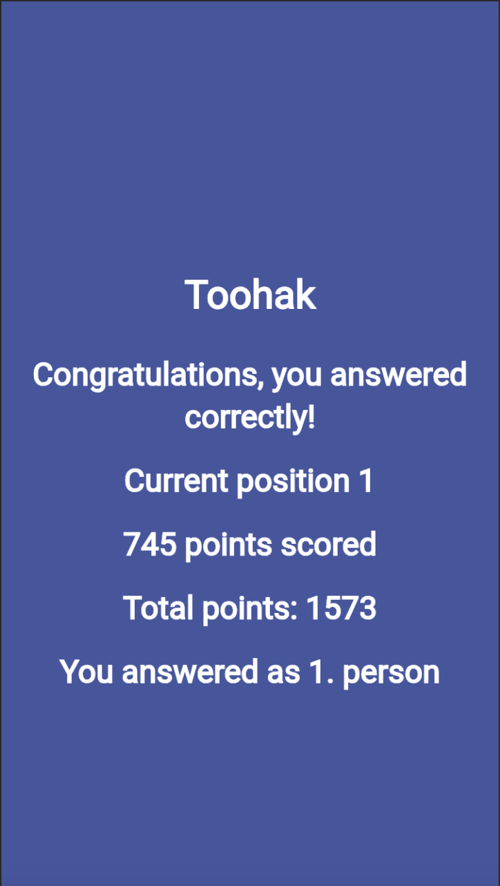

# Toohak

## Description

Toohak is a game-based learning platform, used as educational technology in schools and other educational institutions. It allows teachers to create quizzes which can be accessed by students through a fully responsive web browser. With its interactive and engaging format, Toohak promotes active learning and helps educators assess student understanding in real-time.

## Features

- **Create Engaging Content:** Teachers can create dynamic quizzes tailored to their curriculum and students' needs. With customizable features such as double boost or hints, Toohak makes learning interactive and fun.
  

 
    
    

  
  

  
- **Host Live Games:** Teachers can host live games where students join using a unique game PIN. During the game, questions are displayed on a shared screen, and students answer using their own devices. This real-time interaction fosters engagement and collaboration among students.

  

 
    
    

 
  

- **Double Boost:** Teachers can designate certain questions for a double boost, where correct answers earn students double points, adding an extra element of excitement and challenge to the game.
  

 
    
    

 
  

- **Hint Feature:** Students have the option to use a hint during the game, which reduces their collected points by half. This feature encourages strategic thinking and decision-making.
  

 
    
    

 
  

- **Drafts:** Teachers can create quizzes in draft mode, allowing them to work on their content over multiple sessions before starting a proper game.
  

 
    
    

 
  

- **Hardcore Mode:** For an added challenge, teachers can enable hardcore mode, where students finish the game if they answer a question incorrectly, or proceed to the next question only if they answer correctly or provide no answer. This mode encourages careful consideration of each question and reinforces learning through immediate feedback.
  

 
    
    

 
  

- **Detailed Feedback:** Students receive detailed information and statistics about their answers, including average response time and percentage of correct answers. Also, after each round players receive some information about their current position. This feedback helps students identify areas for improvement and track their progress over time.
  

 
    
    

 
  

## Installation

To use Toohak, simply visit [Toohak website](https://toohak-58bc4.web.app/). Sign up for an account as a teacher and start creating games!

## Usage

### For Teachers

1. **Create Account:** Sign up for a Toohak account or log in if you already have one.
   
2. **Create Toohak:** Select "Create" to start building your quiz. Add questions and answers to make your quiz engaging.
   
3. **Choose Game Mode:** Decide whether you want to host a traditional or hardcore game.
   
4. **Share Game PIN:** Share the unique game PIN with your students to allow them to join the game.
   
5. **Monitor Progress:** During and after the game, use the reports feature to track student performance and understanding.

### For Students

1. **Join Game:** Enter the game PIN provided by your teacher on the Toohak website.
   
2. **Answer Questions:** Answer the questions displayed on your device during the game. Earn points for correct answers and compete with your classmates.
   
3. **Engage:** Participate actively in the game, collaborate with classmates, and have fun while learning.

## Contact
e-mail: anita.sajdak123@gmail.com
  
linkedin: https://www.linkedin.com/in/anita-sajdak-02a254243/
